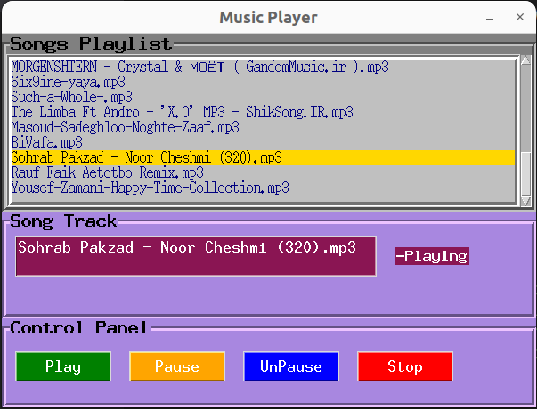

<<<<<<< HEAD
# PyPlayer Repository

Repository for a Python-based music player.

=======
# Music Player Repository

Repository for a Python-based music player.



>>>>>>> df5a2bfcad2bbabfa4d3a8b67c01e230336ec3a7
## About

This repository contains a Python-based music player that allows users to play their favorite music files. It provides a simple and intuitive interface for managing playlists, playing, pausing, skipping tracks, and adjusting volume.

<<<<<<< HEAD
## PyPlayer Demo


=======
>>>>>>> df5a2bfcad2bbabfa4d3a8b67c01e230336ec3a7
## Features

- Create and manage playlists.
- Play, pause, and skip tracks.
- Simple and intuitive user interface.

## Repository Structure

The repository has the following structure:

- `main.py`: The main Python script for the music player application.
<<<<<<< HEAD
- `PyPlayer.exe`: Execute file of the music player interface.
=======
- `music_player.png`: Image file showing a screenshot of the music player interface.
>>>>>>> df5a2bfcad2bbabfa4d3a8b67c01e230336ec3a7

## Getting Started

To get started with the music player, follow these steps:

1. Clone the repository:
<<<<<<< HEAD

    ```bash
    git clone https://github.com/MohamadsalehMoradpoor/PyPlayer.git
    ```

2. Install the required dependencies. You can find them in the `requirements.txt` file.

    ```bash
    pip install -r requirements.txt
    ```

3. Run the `main.py` script.

    ```bash
    python main.py
    ```
=======
```
git clone https://github.com/MohamadsalehMoradpoor/PyPlayer.git
```

2. Install the required dependencies. You can find them in the `requirements.txt` file.
```
pip install -r requirements.txt
```

3. Run the `main.py` script.
```
python main.py
```
>>>>>>> df5a2bfcad2bbabfa4d3a8b67c01e230336ec3a7

4. Enjoy your music!

## Requirements

The following dependencies are required to run the music player:

- Python 3.6+
- Additional dependencies can be found in the `requirements.txt` file.

Make sure you have these dependencies installed before running the music player.

## Contributions

<<<<<<< HEAD
Contributions to this repository are welcome. If you have any ideas or improvements, feel free to open an issue or submit a pull request.
=======
Contributions to this repository are welcome. If you have any ideas or improvements, feel free to open an issue or submit a pull request.
>>>>>>> df5a2bfcad2bbabfa4d3a8b67c01e230336ec3a7
